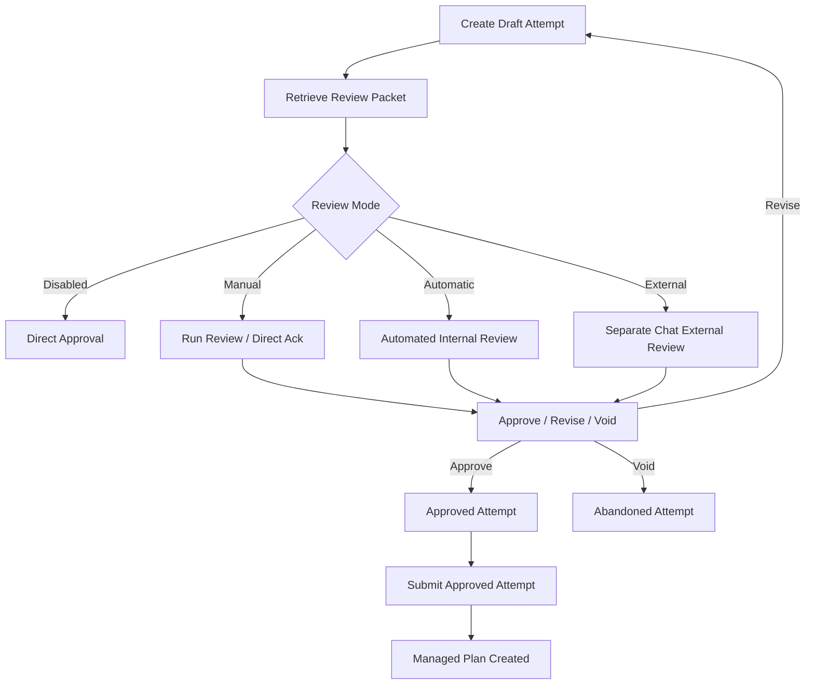

# Intent Drift Review Workflow Guide

This document describes the design, configuration, and operation of Relay's LLM-assisted **Intent Drift Review** workflow.

## Overview

The Intent Drift Review workflow provides a mechanism to verify that a proposed plan matches original requirements and intent before the plan is committed. It helps prevent unintended scope changes, unauthorized modifications, and general drift during planning cycles.

> [!IMPORTANT]
> **Safety Limitation Statement**: Semantic drift review is an LLM-assisted analysis of intent alignment. It is provided as **evidence** for audit and review, not deterministic proof. It **never** replaces explicit operator approval.

---

## The Attempt Lifecycle

Plan submission is divided into a reviewable draft-and-commit lifecycle called a **Plan Attempt**:

1. **Create Draft Attempt**: Register a candidate Plan JSON and associate it with a starting user request intent. This does **not** write any rows to the main `plans` or `plan_passes` tables.
2. **Retrieve Review Packet**: Fetch a consolidated review context containing the raw Plan JSON, metadata, constraints, user request, and lineage.
3. **Drift Review**: Run a semantic review on the packet.
4. **Approve / Revise / Void**:
   - **Approve**: Move the attempt to an approved state. If warnings/drift were detected, requires explicit operator acknowledgement.
   - **Revise**: Mark the current attempt superseded, and spawn a new draft attempt with linked lineage.
   - **Void**: Abandon the attempt completely.
5. **Submit Approved Attempt**: Finalize the approved draft. This is the **only** path that creates active, managed plan and pass records in the database.

---

## Immutable Intent Lineage

To support long-term auditing and lineage tracking, attempts are connected within an immutable intent thread:

*   **`plan_attempt_id`**: The stable, immutable identifier for a single attempt.
*   **`intent_thread_id`**: A stable lineage thread identifier across the original and all replacement attempts.
*   **`root_intent_packet_id`**: The original intent packet that started the thread.
*   **`parent_intent_packet_id`**: Points to the immediately preceding intent packet in the thread.
*   **`current_intent_packet_id`**: The active intent packet for the current attempt revision.
*   **`submitted_intent_packet_id`**: The final intent packet committed on the submitted managed plan.

---

## Drift Review Configuration

The behavior of the drift review is governed by project-specific review settings.

### Drift Review Modes

*   **`disabled`**: No semantic review is performed. Attempts can be approved directly.
*   **`manual`**: Drift review is optional. Operators can request an internal review or approve the attempt directly with a "no-review acknowledgement".
*   **`automatic`**: Relay automatically performs an internal review before allowing approval.
*   **`external`**: Approval is blocked until a structured external review is submitted.

### Model Tiers

*   **`economy`**: Low-cost, fast model inference.
*   **`standard` (Default)**: Balanced performance and capability.
*   **`high_assurance`**: High-quality reasoning models.
*   **`auto_escalate`**: Start with standard tier. If confidence falls below 0.70, or schema validation fails, or unclear/major drift is detected, automatically retries using the `high_assurance` tier.

---

## Cost Control & Privacy Boundaries

To prevent unexpected billing and protect sensitive code metadata:

1. **Explicit Consent**: Manual mode will **never** perform model calls unless the operator explicitly triggers the review with the `allowModelCall` flag.
2. **Bounded Scope**: Model payloads contain only structured packet fields.
3. **No Chat History Leakage**: Reviews do **not** leak developer conversation transcript histories or environment variables.
4. **Sensitivity Blocking**: Packets are scanned for secrets or high-sensitivity patterns before they are sent to external provider endpoints. If sensitive content is found, the review is blocked immediately with `FailurePacketBlockedSensitive` or `FailureSecretDetectedInPacket`.

---

## Separate-Chat / External Audit Workflow

For strict audit setups where review must be separated from plan generation:

1. **Retrieve Review Packet**: Run the `get_plan_intent_review_packet` tool to get the structured context.
2. **External Review**: Send the packet to a separate chat instance or independent audit tool to run the semantic comparison.
3. **Submit Evidence**: Submit the structured review output back using `submit_intent_drift_review`. This registers the audit evidence without automatically approving or committing the plan.
4. **Approve & Commit**: The operator reviews the submitted audit evidence and calls `approve_plan_attempt`, followed by `submit_plan_attempt`.

---

## MCP and API Tool Catalog

These actions are available via the stdio/HTTP MCP tool surfaces:

*   `create_plan_attempt_with_intent`: Register a candidate Plan JSON and associate it with a starting user request intent.
*   `get_plan_intent_review_packet`: Retrieve the read-only review context.
*   `submit_intent_drift_review`: Persist an external audit review.
*   `revise_plan_attempt`: Create a replacement draft attempt with linked lineage.
*   `void_plan_attempt`: Cancel a draft attempt.
*   `approve_plan_attempt`: Apply review policy and transitions.
*   `submit_plan_attempt`: Finalize and write database records for `plans` and `plan_passes`.
